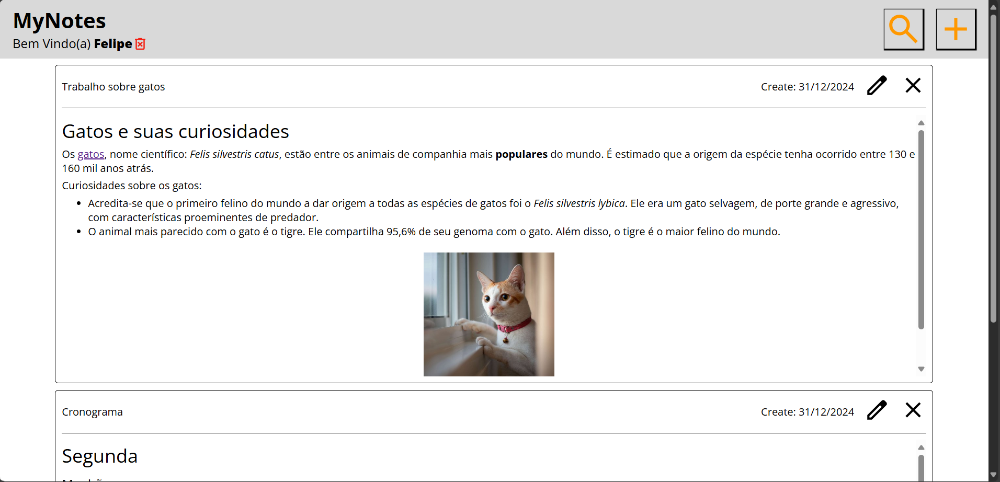
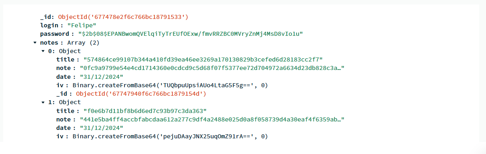

# Uma aplicação simples para armazenar notas


Com a utilização de javascript com node.js, html, css e o banco de dados mongoDB, foi criado uma aplicação chamada MyNotes, em que é possível criar uma conta e várias notas com título e um espaço para escrever o que desejar, utilizando uma formatação simples inspirada no README do GitHub.

Nessa applicação o CRUD utilizado foi o POST, para a criação da conta, o PUT, para editar e adicionar uma nota a conta e o DELETE, que deleta a conta do banco de dados.



Todos os dados que são enviados ao banco de dados são criptografados. A imagem abaixo mostra um exemplo de como os dados ficam no banco de dados para um usuário.



## Como Rodar a aplicação?
É necessário criar uma pasta .env com os seguintes dados: 
- MONGO_URI (Link do banco de dados, criar uma conta gratuita no [Atlas](https://www.mongodb.com/products/platform/atlas-database))
- tokenSecret (Senha para o token, responsável de manter a sessão do usuário)
- encryptSecret (Senha para a criptografia reversível, deve possuir 32 caracteres)
- alg (Algoritmo da criptografia, pode ser aes-256-cbc)

Fazer as mudanças necessárias na parte server.js, trocando o dbName, para conectar corretamente no seu banco de dados e também no model.js modificando o model para que conecte na sua coleção

Depois disso inicie o programa no terminal com ```npm start``` que vai abrir um servidor local na porta 8080, depois disso abra em um navegador o servidor local http://localhost:8080/