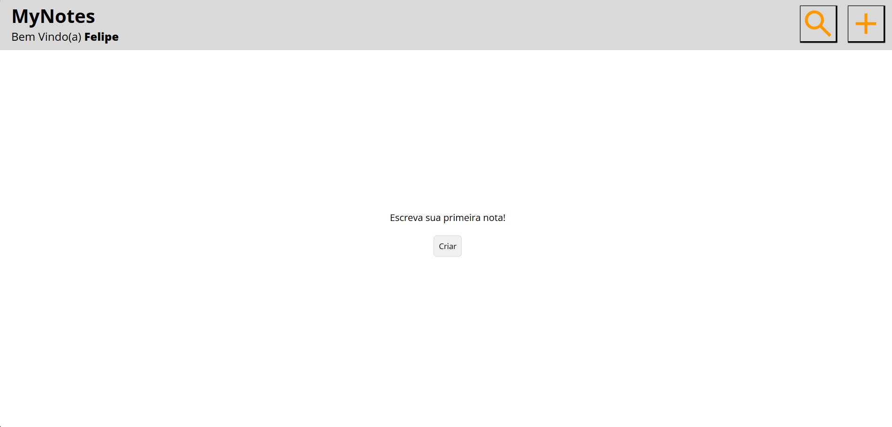

# A Simple Application to Store Notes


Depois passar para inglês...

Foi utilizado javascript, html, css e alguns frameworks do node.js e o banco de dado utilizado foi o mongoDB

Nessa applicação é possível fazer um POST (nova nota), PUT (atualizad nota), PUT (deletar uma nota). Implementações futuras será adicionado DELETE para deletar a conta.

Em relação a criptografia, somente a senha é criptografada. Será implementado futuramente a criptografia para todas as notas

## How Run the Application
É necessário criar uma pasta .env com os seguintes dados: 
- MONGO_URI (Link do banco de dados, criar uma conta gratuita no [Atlas](https://www.mongodb.com/products/platform/atlas-database))
- tokenSecret (Senha para o token, responsável de manter a sessão do usuário)

Depois disso inicie o programa no terminal com ```npm start``` que vai abrir um servidor local na porta 8080, depois disso abra em um navegador o servidor local http://localhost:8080/